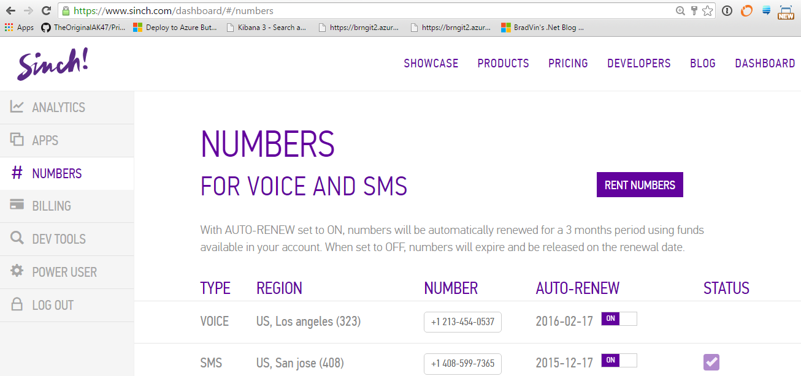
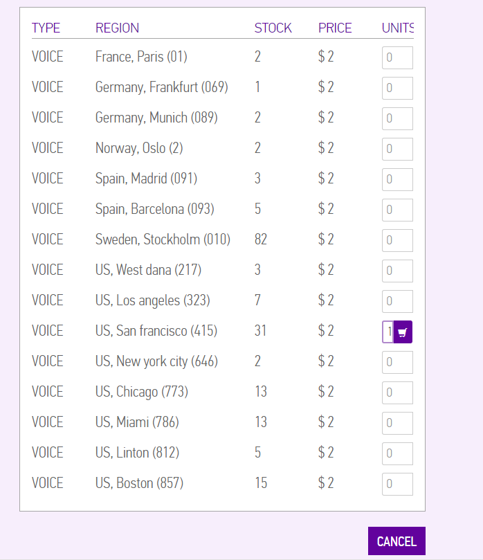
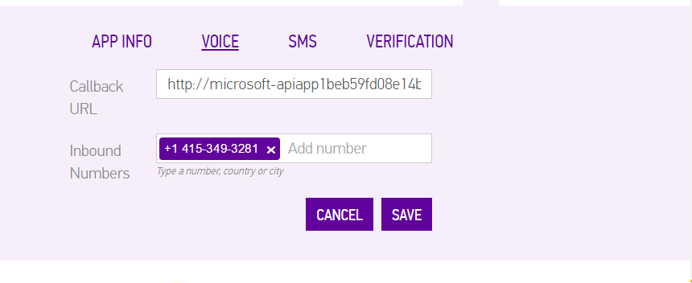
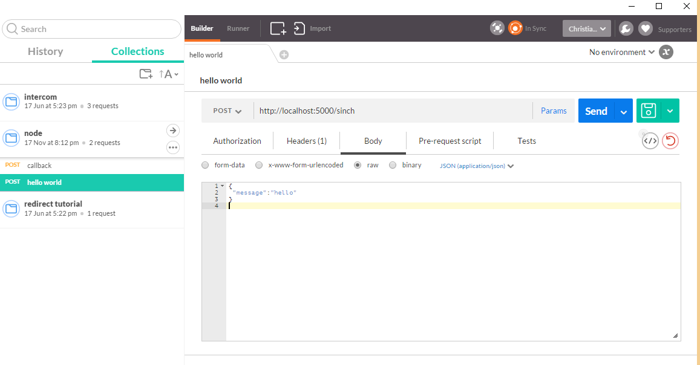

# Creating a hot line using Node/Express and Sinch

in this tutorial we are going to create a very simple conference app where you anyone can call in to a number and be connected. A little bit like the carriers hotlines back in the day (maybe they still exist, any one know?). 
This will take you approx 15 min to finish

## Setup
1. A [Sinch account](https://www.sinch.com/signup) and an app with keys 
2. A phone number [rented from Sinch] (https://www.sinch.com/dashboard/#/numbers); make sure it’s a voice number
3. A place to host your backend, I am hosting my app on azure for free

## Rent a number
Go to your dashboard an rent a number 


AFter your rented a number you need to configure your app, if you dont have just create a new one. 

For this tutorial the endpoint for callbacks will be http://yourserver/sinch so make sure you have a place to host and configure your callback to that address.

So now I have an app that as soon as someone dials +14153493281 will make a callback to my url, since I have nothing there now the call will just hangup.

## Create a node app
As I mentioned before, this is going to be a super simple implementation where everyone will be connected to the conference no questions asked. 
Lets start creatign a node app, open a powershell or terminal and create a folder to host your app. 
```powershell
npm init
npm install express -save
npm install body-parser -save
```
This creates a packages.json file and install express depenency [http://expressjs.com/](http://expressjs.com/) the reason for using express apart from that its popular is it has some nice json extensions and I like mvc frameworks as an organisation for webapps. With that said open up your favorite text editor, I am using VS Code, awesome tool with debug and really nice intellisense, enough MS plugs for now ;). Open up packages.json and change main to app.js. 

```javascript
{
  "name": "nodecallbacks",
  "version": "1.0.0",
  "description": "",
  "main": "app.js",
  "scripts": {
    "test": "echo \"Error: no test specified\" && exit 1"
  },
  "author": "",
  "license": "ISC",
  "dependencies": {
    "express": "^4.13.3"
  }
}

```
Next create app.js in the root folder, and start coding 
**app.js**
```javascript
// add requires
var express = require('express');
var bodyParser = require('body-parser');
var router = require('./routes/sinch');

//set up an app
var app = express();
//configure on what port express will create your app
var port = process.env.PORT || 5000;

//congigure body parsing for the app, 
//in this tutorial we will be doing json only
app.use(bodyParser.json());

//add the sinch route 
app.use('/sinch', router);

//add default content type for all requests
app.use(function (req, res, next) {
  res.setHeader("Content-Type","application/json");
  next();
});
//export and start listening
module.exports = app;
app.listen(port);
```

Nothing strange here, just some basic express setup of an app. note that now we dont respond to anything, yet. Create a folder and callit routes and add a file sinch.js to it. This will be our route to handle posts from the sinch backend.
**sinch.js**
```javascript
// add requires
var express = require('express');
var router = express.Router();
router.post('/', function (req, res, next) {
	//echo the post
	res.json(req.body);
}
);
module.exports = router;
```

The only thing this router does at the moment is to echo what ever your post in to sinch. Try it out and make sure it works. I am using Postman to create my day to day testing. 


## Add Sinch funcationality. 
As mentioned before as soon as someone calls in on a the phonenumber sinch will make a call back to my backend and I can respond with what we call SVAML, General information about our rest API's can be found [here](https://www.sinch.com/docs/voice/rest/) and for this tutorial we are particularly interested in the [ICE](https://www.sinch.com/docs/voice/rest/#ICE) event. 
So when ever someone calls in I want to connect them to my conference with their caller id. So Reading the docs, I see that if to connect to a conference (which is infact exactly what a hot line is) I just need to respond this:

```javascript
{
    "Action": 
    {
        "name" : "ConnectConf",
        "conferenceId" : "myConference123"
    }
}
```
But I also wanted to spice it up and welcome the caller with a text to speech command in the instructions parameters.
```javascript
{
    "name" : "Say",
    "text" : "Hello, this is a text to speech message",
    "locale" : "en-US"
}
```

In sinch.js just below var router

```javascript
var svamlResponse =
	{
		instructions: [
			{
				"name": "Say",
				"text": "Welcome to the hotline",
				"locale": "en-US"
			}
		],
		action: {
			"name": "ConnectConf",
			"conferenceId": "myconference1",
			"cli": "",
			"suppressCallbacks": true
		}
	}

```
You might notice that I added supressCallbacks, this is because in this case I dont want any more callbacks after the ICE event. So to connect to the conference we need to change the the router.post to this

```javascript
router.post('/', function (req, res, next) {
	//we know its a ICE event since we supress callbacks for other events
	// set the callerid to the calling number
	svamlResponse.action.cli = req.body.cli;
	//send back the response.
	res.json(svamlResponse);
});
```

Fire it up localy and try and send this fake incoming body to your controller in post man
fake request
```
{
   "event":"ice",
   "callid":"2DOQGZ3D2JA5JB54BI4OTPFT3I@81.201.84.195",
   "timestamp":"2015-11-11T03:28:25Z",
   "version":1,
   "userRate":{
      "currencyId":"USD",
      "amount":0.0
   },
   "cli":"15612600684",
   "to":{
      "type":"did",
      "endpoint":"+17864088196",
      "verified":null
   },
   "domain":"pstn",
   "applicationKey":"1680b6f8-aa0e-422f-bf25-932adb3a48af",
   "originationType":"PSTN"
}
```
And if everything works you should get back a response like this
**response**
```javascript
{
  "instructions": [
    {
      "name": "Say",
      "text": "Welcome to the hotline",
      "locale": "en-US"
    }
  ],
  "action": {
    "name": "ConnectConf",
    "conferenceId": "myconference1",
    "cli": "15612600684",
    "suppressCallbacks": true
  }
}
```

In order to test, deploy it your server that sinch can access, make a test request to make sure you still get the correct SVAML response. Then dial in!

More resources:
Sinch REST documentation: https://www.sinch.com/docs/voice/rest/
Conferencing system in .net: https://www.sinch.com/tutorials/building-a-conferencing-system/
Hosting node on azure: https://azure.microsoft.com/en-us/documentation/articles/web-sites-nodejs-develop-deploy-mac/
